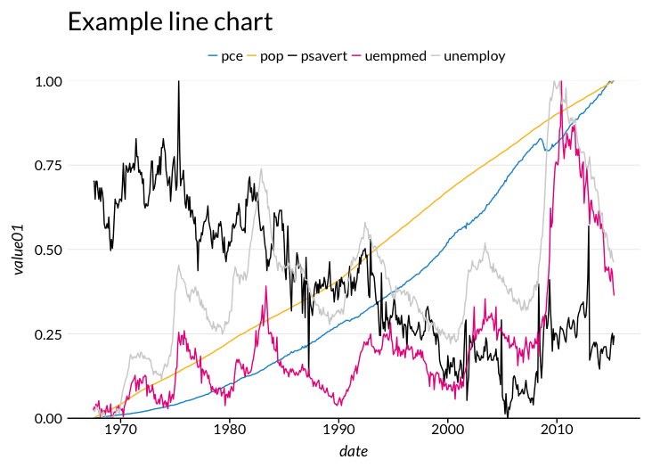
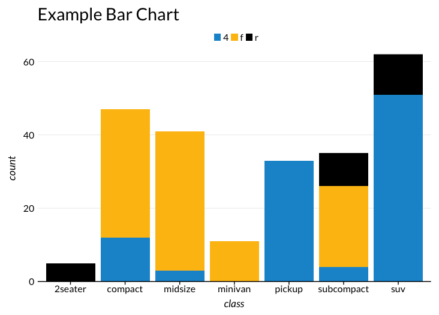
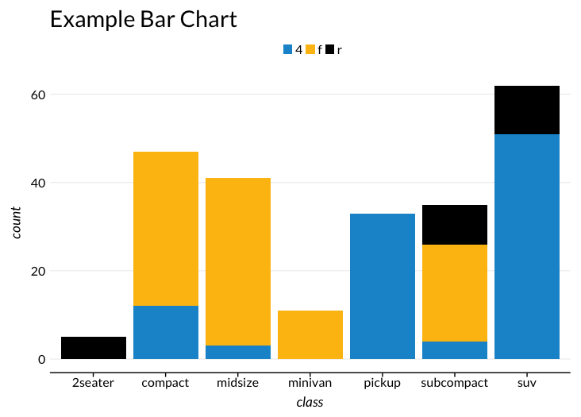

## Urban Institute R graphics guide

A guide to building R graphics at the Urban Institute can be found [here](http://urbaninstitute.github.io/urban_R_theme/).

## Urban Institute ggplot2 theme

Depending on your operating system, run one of the following scripts once per R session:

**Windows**
```
source('https://raw.githubusercontent.com/UrbanInstitute/urban_R_theme/master/urban_theme_windows.R')
```

**Mac**
```
source('https://raw.githubusercontent.com/UrbanInstitute/urban_R_theme/master/urban_theme_mac.R')
```

This `R` script makes `ggplot2` output align more closely with [the Urban Institute's Data Visualization style guide](http://urbaninstitute.github.io/graphics-styleguide/).

This script does **not produce publication ready graphics**. Visual styles must still be edited using your project/paper's normal editing workflow.
-  ***Exporting charts as a pdf will allow them to be more easily edited***
-  You may need to tweak pdf export options to preserve fonts. For example, in RStudio on OSX, check this option in the export pdf window: 

The theme is optimized for the most common chart types: [line charts](http://docs.ggplot2.org/current/geom_path.html), [scatter plots](http://docs.ggplot2.org/current/geom_point.html), and [bar charts](http://docs.ggplot2.org/current/geom_bar.html)

The theme has been tested against `ggplot2 version 2.2.0`. It will not function properly with older (`< 2.0.0`) versions of `ggplot2`

### Installation
If it is not already installed, please install the free [Lato font from Google fonts](https://www.google.com/fonts/specimen/Lato).

#### Windows users
If you're on Windows, you'll first need to [install Ghostscript](http://ghostscript.com/download/). You may need to have IT enter an admin password for this installation. Then, in R, tell R where your ghostscript file is.
```
# Edit the file path if yours is in a different place
Sys.setenv(R_GSCMD="C:/Program Files/gs/gs9.05/bin/gswin32c.exe")
```

#### Everyone
Then, run:

```
install.packages(c("ggplot2", "reshape2", "RColorBrewer", "extrafont"))
library(extrafont)
font_import()
loadfonts()
```

Loading and importing fonts may take a few minutes.

After the initial installation, to use Lato just load the library in each R session:
```
library(extrafont)
```
For more information, and to learn how to embed Lato in PDF exports, see the [extrafont README](https://cran.r-project.org/web/packages/extrafont/README.html)

### Charting!
#### An example line chart:
```
ggplot(economics_long, aes(date, value01, colour = variable)) +
  geom_line() +
  scale_y_continuous(expand = c(0,0)) +
  labs(title = "Example line chart")
```


**Note that**

- `labs(title = "Title")` Should always be used to add a title to charts
- `scale_y_continuous(expand = c(0,0))` removes gaps between the axis lines and the origin

### An example bar chart
```
ggplot(mpg, aes(class)) +
  geom_bar(aes(fill = drv)) +
  scale_y_continuous(expand=c(0,0)) +
  labs(title = "Example Bar Chart")
```

**Note that**

- `labs(title = "Title")` Should always be used to add a title to charts
- `scale_y_continuous(expand = c(0,0))` removes gaps between the axis lines and the origin. Without this option, bar charts look like:



## R Theme Copyright and License 

Copyright 2017 Urban Institute. Code released under the GNU General Public License v3.0