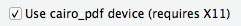

##Urban Institute ggplot2 theme

[Run this script once per R session](urban_ggplot_theme.R)


This is an `R` script that can be run to make default `ggplot2` output align more closely with [the Urban Institute's Data Visualization style guide](http://urbaninstitute.github.io/graphics-styleguide/).

- This script does **not produce publication ready graphics**. Visual styles must still be edited using your project/paper's normal editing workflow.
	-  ***Exporting charts as a pdf will allow them to be more easily edited***
	-  You may need to tweak pdf export options to preserve fonts. For example, in RStudio on OSX, check this option in the export pdf window: 

- The theme is optimized for the most common chart types: [line charts](http://docs.ggplot2.org/current/geom_path.html), [scatter plots](http://docs.ggplot2.org/current/geom_point.html), and [bar charts](http://docs.ggplot2.org/current/geom_bar.html)

- The theme has been tested against `ggplot2 version 2.1.0`. It will not function properly with older (`< 2.0.0`) versions of `ggplot2`

###Installation
If it is not already installed, please install the free [Lato font from Google fonts](https://www.google.com/fonts/specimen/Lato).

Then, run:

```
install.packages(c('shiny','ggplot2','reshape2','RColorBrewer','plyr','stringr','extrafont'))
library(extrafont)
font_import()
loadfonts()
```

Loading and importing fonts may take a few minutes.


###Charting!
####An example line chart:
```
ggplot(economics_long, aes(date, value01, colour = variable))
+ geom_line()
+ scale_y_continuous(expand = c(0,0))
+ ggtitle('Example line chart')
```


**Note that**

- `ggtitle()` Should always be used to add a title to charts
- `scale_y_continuous(expand = c(0,0))` removes gaps between the axis lines and the origin

###An example bar chart
```
ggplot(mpg, aes(class))
+ geom_bar(aes(fill = drv))
+ scale_y_continuous(expand=c(0,0))
+ ggtitle("Example Bar Chart")
```

**Note that**

- `ggtitle()` Should always be used to add a title to charts
- `scale_y_continuous(expand = c(0,0))` removes gaps between the axis lines and the origin. Without this option, bar charts look like:

